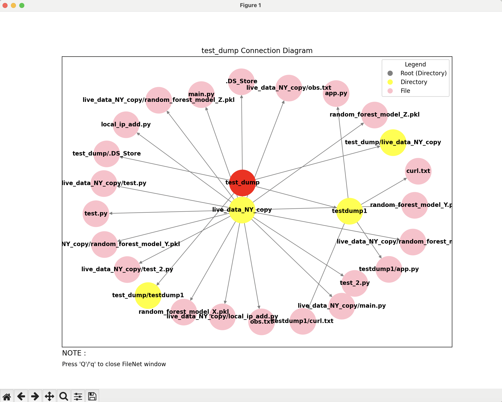

# FileNet

[](https://pypi.org/project/FileNet/)
[](https://pypi.org/project/FileNet/)

--


FileNet is a library to visulaize your directories and files with their hierarchical relation in 2D or 3D.
## Installation

Use ```Python >= 3.12```

```bash
pip install FileNet
```
or
```bash
pip3 install FileNet
```

## Usage

### Using 2D visualization :

- <b><mark>draw2D</mark></b> take two arguments, ```'start_path'``` and ```'theme'```. ```'start_path'``` is mandatory argument and ```'theme'``` has a default value of ```'4'``` which can be changed between ```1``` to ```4```.

```python
import FileNet

FileNet.draw2D(start_path = "Replace with complete Root Directory Path", theme = 4)
```

### Using 3D visualization :

- <b><mark>draw3D</mark></b> takes only one argument ```start_path```.

```python
import FileNet

FileNet.draw3D(start_path = "Replace with complete Root Directory Path")
```
## Demo
### 3D Demo :

https://github.com/user-attachments/assets/ef62fb46-470f-40da-a856-421c416155d6

### 2D Demo :


## Upcoming Improvements

- Saving 3D Images.
- Enhanced Customization.
